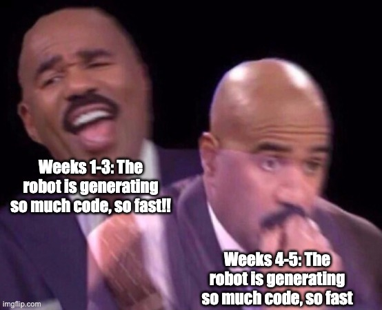

# What I am learning from vibe coding a giant enterprise app :)

## LLM codegen is *Lethal Weapon*

* You have been doing this for years, by the book. You are a veteran that has seen it all and knows the score
* Your new partner has unconventional, disruptive methods that bring stunning results
* Your new partner is also an erratic psychopath who is going to get you killed
  * If you don't have a story of the robot doing something completely insane, you will have one soon.
* You have to rein your partner in while letting your partner push you out of your comfort zone. Mutual growth
* I have never seen *Lethal Weapon*

## And I cannot emphasize this enough, Tests

* Write tests as soon as you write code
  * (That is, tell the robot to write them)
* Make sure your tests are strong and representative
  * We started with unit tests and e2e tests
  * We test against a live database using the same migrations
  * We have BDD / features
  * We have client-side tests (Vitest)
  * We have Playwright e2e tests
* You'll have to pay attention to test performance, because your robot is writing a lot and executing them often

## But... the robot is writing the tests

* I was told "don't trust the robot" and that all codegen should be reviewed by a human
* I was told this by... another robot
* I'm not comfortable with that. What's the point of this velocity, then?
* But there has to be some oversight. *See above re: erratic psychopath.*
* Defense in depth: do more with your CI. Much more
  * Mutation testing
  * Flaky test analysis
  * Static code analysis
  * Race detection analysis
  * Architecture analysis
* Engineers still need to review the code. But how much?
* I want to pit robots against robots.
* I am still figuring this part out

## Documents, instructions, context, context, context
* https://docs.github.com/en/copilot/how-tos/configure-custom-instructions/add-repository-instructions
  * A context guide to the app, a list of grievances 
* Make the robot write the documentation. Make it revise it often. Context always helps results
* Make sure the robot always has an index to find the files
* Work with the robot on specs. Have a canned spec prompt
* Make the robot do plans. Have a canned plan prompt

## Why Greenfield is Easier

* We live in a world of frameworks and mature patterns
  * database: golang-migrate
  * ORM: gorm
  * Frontend: vue.js, tailwind, pinia
  * Frontend Components: PrimeVue
  * Logging: slog  
* The patterns help keep things on track
* A lot of the start of an app is boilerplate and setup
* I think my best day was ~15,000 lines of code. And Miles has surely beaten that.
* It slows down and gets trickier as you go from boilerplate to business implementations.
  
## This isn't the stereotype of "vibe coding", but it's not *not* vibe coding

* You, and tests, and the robot itself, can tend to this code and make sure it's not slop
* That takes a lot of scaffolding.
* Watch the robot. Let it cook, but know what it's doing, as best you can.
* Give it some safe commands to auto-execute. Just a few.
* Good prompting == good communication
* Make it tell you a plan when it executes. READ THE PLAN (don't just click through) and understand it.
* Look at your PRs and understand them. (not every line. understand the whole)
* Review the codebase every few iterations. Don't read every line of code, but look for bad patterns
  * New components when re-use would have worked (Code duplication can be a static code analysis step)
  * Giant files. (This can be a static code analysis step) 

## Fun "tail-eating" moments

* Have Copilot on github.com review your PR
  * (They really need to stop calling *everything* Copilot)
* ~~Your IDE agent calls `gh pr view <PR_NUMBER> --comments`~~
* ~~Your IDE robot addresses the comments from the github.com robot~~
* Github.com copilot can just address the comments now with new PRs. Let it cook and rebase them in.
* Lather, rinse, repeat the virtuous cycle
  * This catches nitpicks really well. I don't know if it's the whole shebang, yet.
* I want to pipe low-hanging static code analysis results to a robot on Github that just takes care of the results. Get back to me on this

## Every robot has a personality.

* THESE ARE ALL SUBJECTIVE and this is not a SWE benchmarking resource
* GPT 5-mini: high derp level, spirals
* Sonnet 4.5: overconfident, spirals less often but still does sometimes
  * Haiku 4.5: more overconfident, spirals more, talks more, you get what you pay for
  * Lots of document generation, try hard, pick me
  * I use Claude as my daily driver for architecture, life, it's great. Not sure why it doesn't click for me in a coding context. Shrug emoji 
* GPT 5-Codex: quieter, more organized, slow, better? maybe nefarious
* The models since September are better than the models before September.
* The models next year will be much better than this year. They are already good.
* I fully believe this is where everything is going.
  * We're not going to be coding by hand.
  * We have to pit robots against robots. Robot solutions for robot problems
  * We have to let go of the memory of that elegant one line of code that did it so well and so sweet. Yes, it was great. Let it go.
  * We also have to let go of the nostalgic fantasies of human-generated code. LLM codegen has problems, yes, but most human-generated code is not poetry
  * We need to figure out how to use these tools, and use them well. When we do, we'll be unstoppable
